# Sensores de monitoramento

> Este guia foi elaborado por **Enéas Almeida** com o principal objetivo de facilitar os repasses de informações à equipe.

## Info

Sensores de monitoramento utilizando comunicação assíncrona com RabbitMq e Java.

**Recursos:** Java | Microservice | SpringBoot | Gradle | RabbitMQ | Retry Pattern | Dead Queue | Docker | MongoDB.

## Modelagem inicial (Monólito)

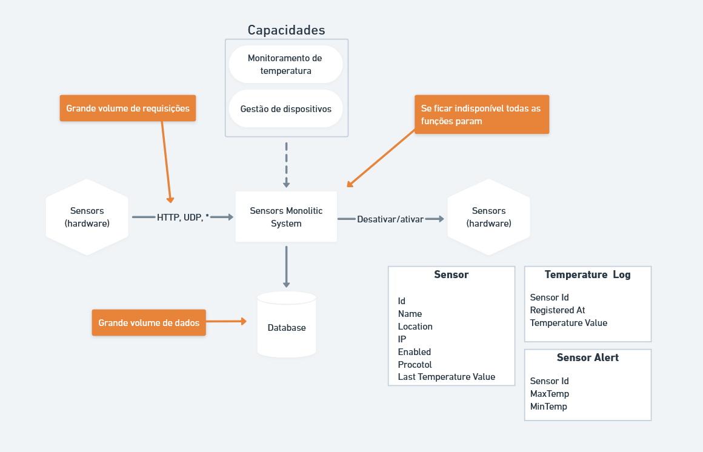

## Modelagem final (Microserviços)

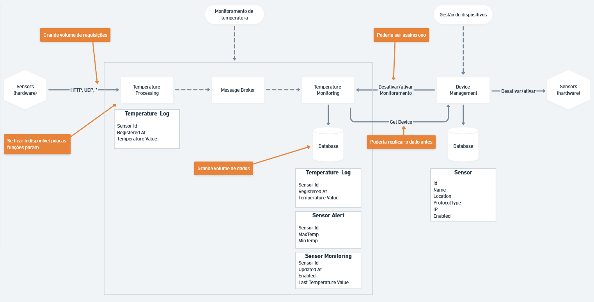

### ⚓ Links dos microserviços

👉 [Gerenciador de dispositivos](https://github.com/eneas-almeida/ms-sensors-device-manager)<br />
👉 [Monitoramento de temperaturas](https://github.com/eneas-almeida/ms-sensors-temperature-monitoring)<br />
👉 [Processamento de temperaturas](https://github.com/eneas-almeida/ms-sensors-temperatura-processing)<br />

## Etapas de desenvolvimento

1. Entendimento do problema a ser resolvido;
2. Levantamento dos requisitos funcionais;
3. Definição do padrão arquitetural utilizado;
4. Definição das tecnologias utilizadas;
5. Definição das atribuições e cronograma de estimativas no desenvolvimento das atividades;
6. Desenvolvimento do código fonte.

## Ajuda

## Modelo de repositórios

A arquitetura adotada segue um modelo híbrido entre monorepo e multirepo: há um repositório principal responsável por coordenar e integrar os demais microserviços, que são mantidos em repositórios independentes. Essa abordagem busca equilibrar centralização e autonomia no desenvolvimento e manutenção dos serviços.

### Criando submodulos

```bash
git submodule add https://github.com/eneas-almeida/ms-sensors-temperature-processing.git .\microservices\temperature-processing
```

### Configurações do build.gradle

```bash
plugins {
	id 'idea' # Adiciona essa linha
}

# Adiciona esse bloco para o javadocs e sources
idea {
	module {
		downloadJavadoc = true
		downloadSources = true
	}
}

# Adiciona a dependência abaixo

dependencies {
    # Manipulação de strings, números, objetos ou arrays, essa biblioteca pode economizar bastante tempo e reduzir bugs.
	implementation 'org.apache.commons:commons-lang3:3.17.0'
    implementation 'io.hypersistence:hypersistence-tsid:2.1.4'
}
```

### Configurações das properties

```bash
spring.application.name=device-manager

server.port=8080

spring.datasource.url=jdbc:h2:file:~/device-management-db;CASE_INSENSITIVE_IDENTIFIERS=TRUE;
spring.datasource.driverClassName=org.h2.Driver
spring.datasource.username=sa
spring.datasource.password=123

# Permite acesso remoto
spring.h2.console.enabled=true
spring.h2.console.settings.web-allow-others=true

spring.jpa.database-platform=org.hibernate.dialect.H2Dialect

# Alterar para create-drop em caso de mudança do schema
spring.jpa.hibernate.ddl-auto=update
spring.jpa.show-sql=true
```

### Para acessar o banco h2

**Acessa a url:** http://localhost:8080/h2-console<br />
**JDBC URL:** jdbc:h2:file:~/device-management-db

### Configurações da VM no Intellij

-   Nome do projeto;
-   Working deirctory de cada microserviço, sentando a pasta correta de cada projeto;
-   Store as project file (checar e colocar a pasta correta do microserviço);
-   Selecionar o build and run;
-   Adicionar na Add VM Options: -XX:MaxRAM=256m

**Obs importante:** Antes de efetuar a configuração abaixo do MaxRAM e working directory, rode o programa antes e depois configure.

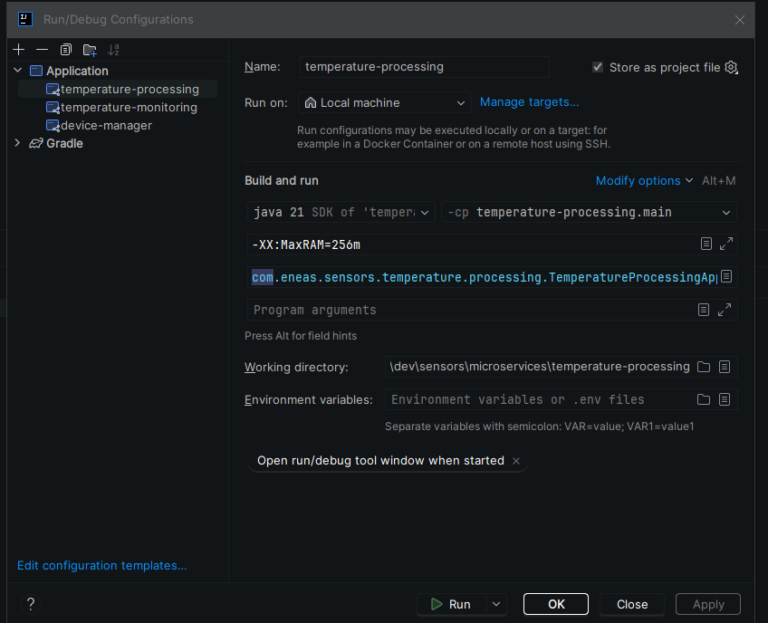

## Links úteis

-   [Biblioteca do Gradle](https://mvnrepository.com/artifact/org.apache.commons/commons-lang3/3.17.0)
-   [Initializr do SpringBoot](https://start.spring.io/)

## RabbitMQ


### Passo 0: subindo o container do RabbitMQ

```bash
docker-compose up -d
```

### Passo 1: acessa a dashboard

<a href="http://localhost:15672">http://localhost:15672</a>

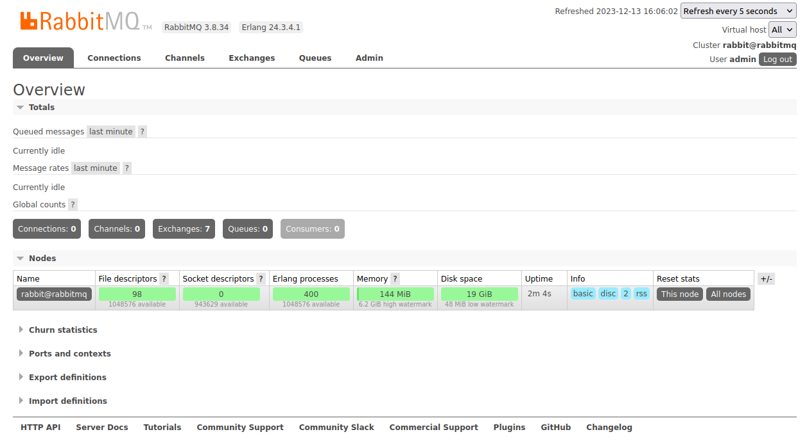

### Passo 2: adiciona uma fila

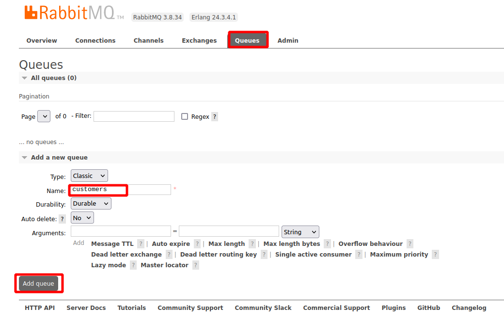

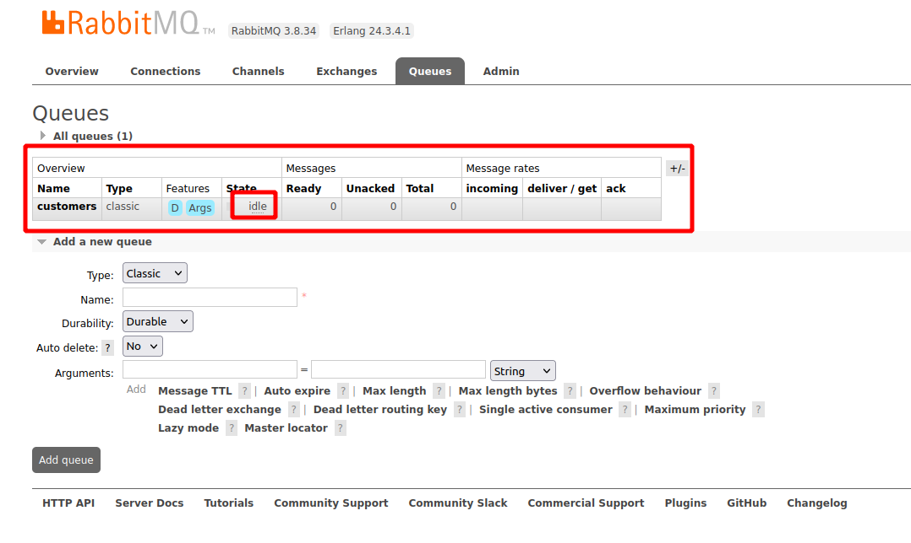

### Passo 3: verifica as exchanges defaults

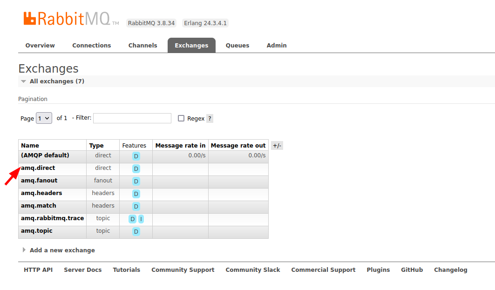

### Passo 4: volta na fila customers criada

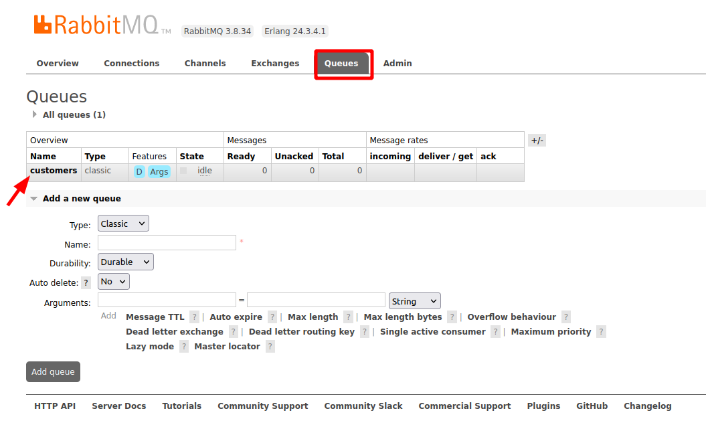

### Passo 5: realiza o binding de uma fila com uma exchange

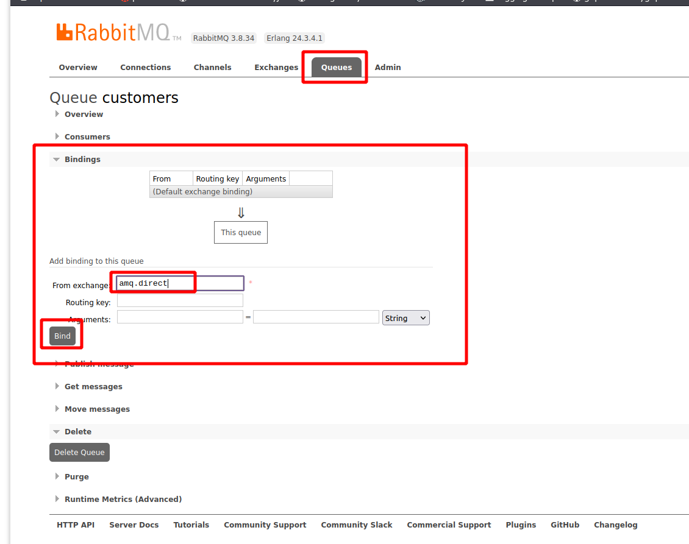

### Passo 6: envia uma mensagem

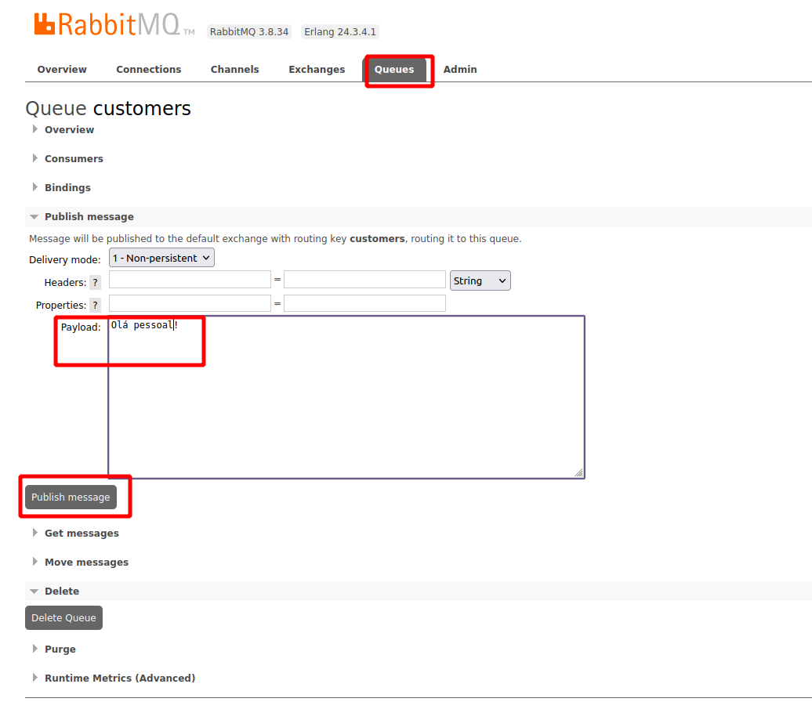

### Passo 5: consome a fila

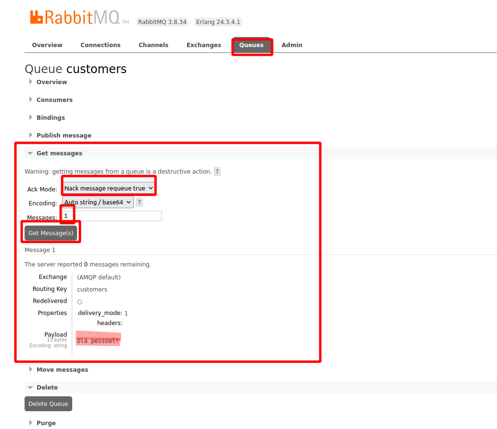

<hr />

© Documento elaborado por <a href="https://github.com/eneas-almeida">Enéas Almeida</a>.
